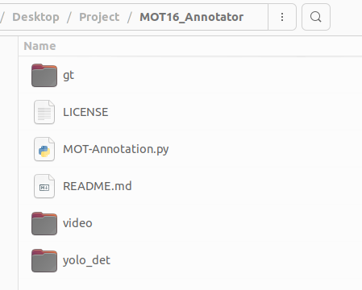
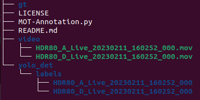

# MOT Annotation Tutorial (with YOLO)

## 1. Use YOLOv7-pose to get the bounding box

1. Clone/Download the yolov7-pose branch
    
    [GitHub - WongKinYiu/yolov7 at pose](https://github.com/WongKinYiu/yolov7/tree/pose)
    
2. Replace the file **detect.py**
    - File modified by YeePon
        
3. Download the testing model (put the file in the yolov7-pose directory)
    - [**yolov7-w6-pose.pt**](https://github.com/WongKinYiu/yolov7/releases/download/v0.1/yolov7-w6-pose.pt)
4. Run the yolov7-pose and get the bounding box
    - Remember change the location where files save
        
        ```bash
        python detect.py --weights yolov7-w6-pose.pt --kpt-label --hide-labels --hide-conf --source **/your_path_to_video/HDR80_A_Live_20230211_160252_000.mov** --exist-ok --name yolo_det --project **/your_path_to_annotator/MOT16_Annotator** --save-txt --nosave
        ```
        

## 2. Use MOT_Annotator

1. Clone the repository MOT_Annotator
    - Github Link: https://github.com/jason0860907/MOT_Annotator_with_YOLO
2. Check the **txt file** and **video** at the correct position
    
    
    - List Directory Tree
        
        
        
        !
        
3. Run Python scripts from the command line (Terminal)
    
    ```bash
    python MOT-Annotation.py -l ./video/HDR80_A_Live_20230211_160252_000.mov
    ```
    
    - Modified from https://github.com/khalidw/MOT16_Annotator

## 3. How to Use Annotator

- Press `n` : Next frame
- Press `i` : Increment object ID
- Press `d` : Decrement object ID
- `Mouse Left Click` to map the YOLO detection bounding box
- `Mouse Middle Click` (click two points) to get the bounding box

💡 The same people in different camera view should be **annotate with the same ID**

